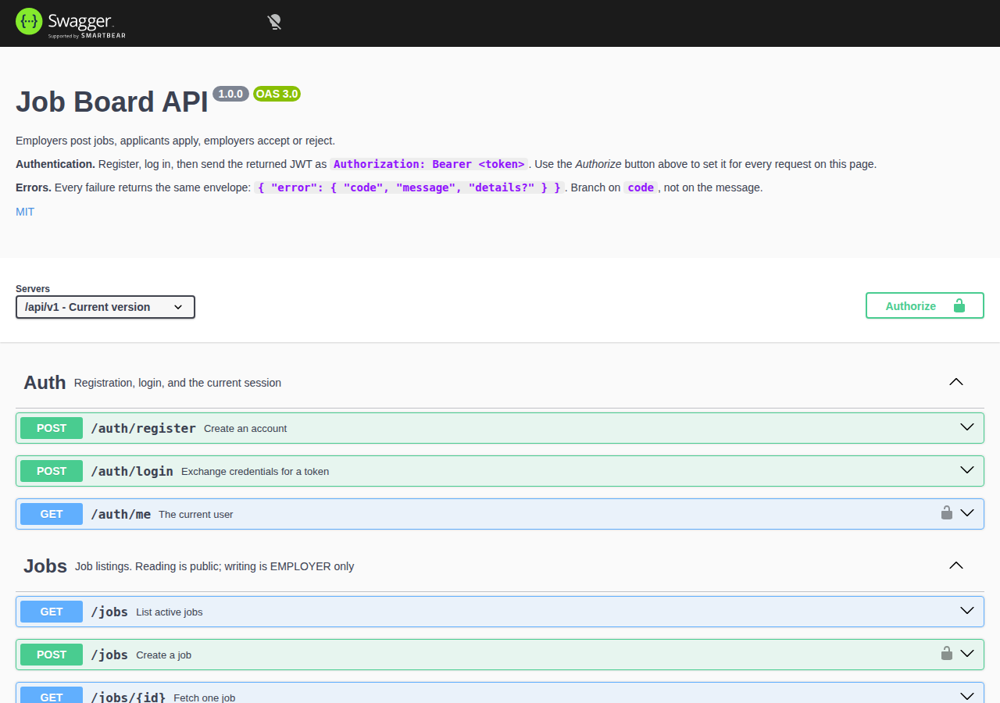
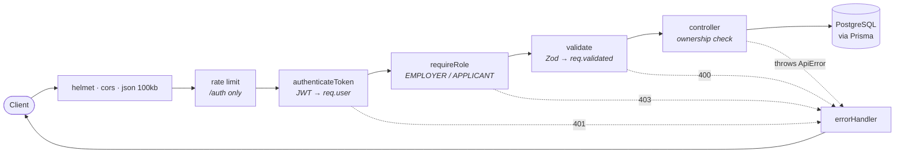
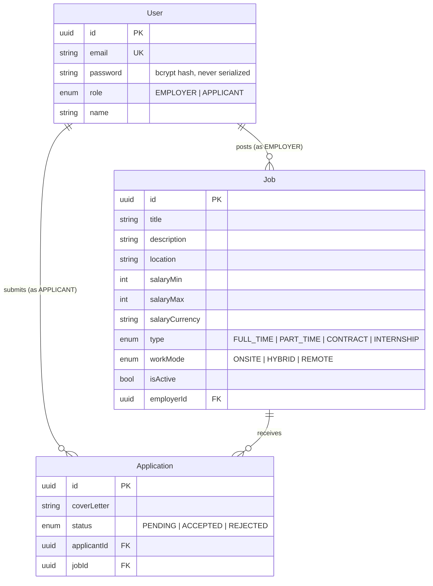

# Job Board API

A production-shaped REST API where employers post jobs, applicants apply, and employers accept or reject the applications they receive.

[](https://github.com/jkkma/job-board-api/actions/workflows/ci.yml)
[](LICENSE)
[](.nvmrc)
[](tsconfig.json)

Built with **TypeScript, Express 5, Prisma, and PostgreSQL**. JWT authentication with role-based access control, 70 integration tests against a real database, and a single command from clone to running API.



> **Live demo:** <https://job-board-api-3ga1.onrender.com>
> Interactive API reference at [`/docs`](https://job-board-api-3ga1.onrender.com/docs), machine-readable spec at [`/openapi.json`](https://job-board-api-3ga1.onrender.com/openapi.json).
> Hosted on Render's free tier, so the instance sleeps after ~15 minutes idle — a measured cold start is **~43 seconds**: ~15s to schedule the container, ~20s running `prisma migrate deploy` and the seed before the port binds, then ~8s while the load balancer waits for the first health check to pass.

---

## Quick start

```bash
git clone https://github.com/jkkma/job-board-api.git
cd job-board-api
docker compose up
```

That's it. Compose starts PostgreSQL, waits for it to accept connections, applies the migrations, seeds demo data, and serves the API on <http://localhost:5000>. Open <http://localhost:5000/docs> and click **Authorize** with a token from `/auth/login`.

Seeded logins (all use the password `password123`):

| Role        | Email             |
| ----------- | ----------------- |
| `EMPLOYER`  | `hire@acme.com`   |
| `APPLICANT` | `ada@example.com` |

<details>
<summary><b>Running without Docker</b></summary>

Requires Node 20+ and a reachable PostgreSQL instance.

```bash
npm install
cp .env.example .env          # then fill in DATABASE_URL and JWT_SECRET
npx prisma migrate deploy
npm run db:seed
npm run dev
```

`JWT_SECRET` must be at least 32 characters — generate one with `openssl rand -base64 32`. Every variable is validated at boot, so a missing or malformed value fails immediately with a readable message instead of throwing on the first request that needs it.

</details>

<details>
<summary><b>A complete request flow with curl</b></summary>

```bash
API=http://localhost:5000/api/v1

# 1. Log in as the seeded employer
TOKEN=$(curl -s -X POST $API/auth/login \
  -H 'Content-Type: application/json' \
  -d '{"email":"hire@acme.com","password":"password123"}' | jq -r .token)

# 2. Post a job
curl -X POST $API/jobs \
  -H "Authorization: Bearer $TOKEN" -H 'Content-Type: application/json' \
  -d '{"title":"Backend Engineer","description":"Build and maintain our API layer.",
       "type":"FULL_TIME","workMode":"REMOTE","salaryMin":90000,"salaryMax":130000}'

# 3. Browse — no auth needed
curl "$API/jobs?search=backend&workMode=REMOTE&salaryMin=100000&page=1&limit=10"

# 4. Apply as an applicant
APPLICANT=$(curl -s -X POST $API/auth/login \
  -H 'Content-Type: application/json' \
  -d '{"email":"ada@example.com","password":"password123"}' | jq -r .token)

curl -X POST $API/applications \
  -H "Authorization: Bearer $APPLICANT" -H 'Content-Type: application/json' \
  -d '{"jobId":"<job-uuid>","coverLetter":"I would love to join."}'

# 5. As the employer, accept it
curl -X PATCH $API/applications/<application-uuid>/status \
  -H "Authorization: Bearer $TOKEN" -H 'Content-Type: application/json' \
  -d '{"status":"ACCEPTED"}'
```

</details>

---

## What's in it

- **Role-based access control** — `EMPLOYER` and `APPLICANT`, enforced by middleware at the route, plus per-resource ownership checks.
- **Validated at every edge** — Zod schemas cover request bodies, query strings, and route params, with a single consistent error envelope.
- **Pagination, filtering, and sorting** — with a hard page-size cap and an allowlist of sortable fields.
- **Centralized error handling** — one place turns any failure into JSON, including the cases that normally escape as HTML.
- **70 integration tests** against a real PostgreSQL database, ~94% line coverage, running in under 10 seconds.
- **CI on every push** — lint, format check, typecheck, migrations, tests with enforced coverage, and a Docker image build.
- **Operable** — liveness and readiness probes, graceful shutdown, request logging, rate-limited credential endpoints.

## Architecture





`Application` carries a composite unique constraint on `(applicantId, jobId)`, so duplicate applications are rejected by the database rather than by a check-then-insert that would race.

```
src/
  app.ts                 # buildApp() — middleware + routes, no listen
  server.ts              # listen, SIGTERM/SIGINT draining, prisma disconnect
  config/env.ts          # Zod-validated environment, fails fast at boot
  lib/
    prisma.ts            # the shared PrismaClient
    ApiError.ts          # errors that carry their own HTTP status
  middleware/
    auth.ts              # Bearer token → req.user
    requireRole.ts       # role gate
    validate.ts          # Zod over body / query / params
    rateLimit.ts         # credential-endpoint throttling
    errorHandler.ts      # the single place an error becomes a response
  routes/                # auth, jobs, applications, health
  controllers/           # request handling and ownership checks
  validations/schemas.ts # every request schema
  docs/openapi.ts        # the OpenAPI document served at /docs
  docs/landing.ts        # the HTML page browsers get at /
```

## API reference

Base URL `/api/v1`. Full interactive reference at **`/docs`**; the spec is at `/openapi.json`.

Protected routes take `Authorization: Bearer <token>`.

`/` is content-negotiated: a browser gets an HTML landing page, while `curl` and anything else sending `*/*` gets the JSON discovery document `{ "message", "version", "docs" }`.

### Auth

| Method | Path             | Auth | Description                                                     |
| ------ | ---------------- | ---- | --------------------------------------------------------------- |
| `POST` | `/auth/register` | —    | Create an account. `409` if the email is taken.                 |
| `POST` | `/auth/login`    | —    | Returns a JWT. `401` on bad credentials.                        |
| `GET`  | `/auth/me`       | ✅   | The current user, read from the database rather than the token. |

### Jobs

| Method   | Path        | Auth              | Description                                                                                                                    |
| -------- | ----------- | ----------------- | ------------------------------------------------------------------------------------------------------------------------------ |
| `GET`    | `/jobs`     | —                 | Paginated active jobs. Filters: `search`, `location`, `type`, `workMode`, `salaryMin`. Plus `page`, `limit` (max 100), `sort`. |
| `GET`    | `/jobs/:id` | —                 | One job. Employer **name only** — no email on this public route.                                                               |
| `POST`   | `/jobs`     | `EMPLOYER`        | Create a job owned by the caller.                                                                                              |
| `PUT`    | `/jobs/:id` | `EMPLOYER`, owner | Update any subset of fields plus `isActive`.                                                                                   |
| `DELETE` | `/jobs/:id` | `EMPLOYER`, owner | `204`. Cascades to the job's applications.                                                                                     |

Listings come back as `{ data: [...], meta: { page, limit, total, totalPages, hasNext } }`.

### Applications

| Method  | Path                       | Auth              | Description                                                         |
| ------- | -------------------------- | ----------------- | ------------------------------------------------------------------- |
| `POST`  | `/applications`            | `APPLICANT`       | Apply. `409` on a duplicate, `404` if the job is missing or closed. |
| `GET`   | `/applications/my`         | ✅                | The caller's own applications.                                      |
| `GET`   | `/applications/job/:id`    | `EMPLOYER`, owner | Applications for one of your jobs, with applicant contact details.  |
| `PATCH` | `/applications/:id/status` | `EMPLOYER`, owner | Set `ACCEPTED` or `REJECTED`.                                       |

### Health

`GET /health` is liveness and does no I/O. `GET /health/ready` pings the database and returns `503` when it is unreachable.

### Errors

Every failure — validation, auth, a malformed JSON body, an unmatched route — returns the same envelope. Branch on `code`, not on `message`.

```json
{
  "error": {
    "code": "VALIDATION_FAILED",
    "message": "Validation failed",
    "details": [{ "path": "password", "message": "Password must be at least 8 characters" }]
  }
}
```

`BAD_REQUEST` · `VALIDATION_FAILED` · `MALFORMED_JSON` · `UNAUTHORIZED` · `FORBIDDEN` · `NOT_FOUND` · `CONFLICT` · `PAYLOAD_TOO_LARGE` · `TOO_MANY_REQUESTS` · `INTERNAL_ERROR`

## Testing

```bash
npm test              # 70 tests
npm run test:coverage # with thresholds enforced
```

The suite runs against a real PostgreSQL database rather than a mocked Prisma client, so it exercises routing, middleware ordering, the role guards, Zod coercion, and genuine constraint violations. Tests share one database and `TRUNCATE ... RESTART IDENTITY CASCADE` between cases; the truncate list is read from `pg_tables` so a new model is cleaned up automatically, and the setup refuses to run at all unless the database name contains `test`.

CI runs lint, format check, typecheck, `prisma migrate deploy`, and the suite against a `postgres:16` service container on every push, then builds the Docker image.

## Design decisions

**Prisma over raw SQL or a query builder.** The schema is small and relational, and Prisma's generated types mean the domain model is checked at compile time without hand-writing row interfaces. The cost is a heavier dependency and less control over the emitted SQL — worth it at this size, less obviously so once queries get complex.

**Integration tests over unit tests.** Mocking Prisma would mostly test the mock. Nearly every bug this API can have lives in the seams — middleware order, a missing role gate, a unique constraint, a status code — and only a real request through a real router against a real database catches those. Unit tests are reserved for pure logic like the env schema.

**Stateless JWTs, with a known limitation.** Tokens are self-contained and expire in 7 days; there is no server-side session, which means **there is currently no way to revoke one before it expires**. The honest fix is short-lived access tokens plus rotating refresh tokens with reuse detection — a feature in its own right, listed below rather than half-built here. `GET /auth/me` already reads from the database rather than the token, so at least a changed role takes effect immediately.

**No `asyncHandler` wrapper.** Express 5 forwards rejected promises from async handlers to the error middleware natively. Wrapping every route in `asyncHandler` is an Express 4 workaround that no longer buys anything, so it isn't here — and a test asserts a throwing async handler still produces the JSON 500 envelope.

**Status codes.** `401` means the caller failed to authenticate; `403` means we identified them and they still may not do this. Login answers identically for an unknown email and a wrong password, deliberately, so it cannot be used to enumerate accounts.

**Search is not indexed, and the schema says so.** The `search` filter uses `contains`, which compiles to `ILIKE '%term%'` — a btree index cannot serve that, so adding one on `title` would be decoration. Doing it properly needs a `pg_trgm` GIN index; until then the limitation is documented rather than papered over. The indexes that _are_ there match real access paths: `(isActive, createdAt DESC)` for the listing query, and `jobId` on applications. There is intentionally no index on `applicantId` — it is already the leading column of the composite unique constraint.

**The `prisma` CLI is a runtime dependency.** The container applies `prisma migrate deploy` when it starts, so the CLI has to ship in the image. It costs image size in exchange for `docker compose up` being genuinely one command.

## What I'd do next

- **Refresh token rotation** — short-lived access tokens plus hashed, rotating refresh tokens with reuse detection, which is what closes the revocation gap above.
- **Trigram search** — a `pg_trgm` GIN index so `search` stops being a sequential scan, with `EXPLAIN ANALYZE` before and after.
- **Company profiles** — employers currently _are_ the company; a real `Company` model would let several recruiters share listings.
- **Job expiry** — an `expiresAt` column folded into the active-jobs filter, plus a "closing soon" sort.
- **Cursor pagination** — offset pagination degrades on deep pages; a `createdAt`-keyed cursor would hold up better.

## Scripts

| Command                              | Action                                   |
| ------------------------------------ | ---------------------------------------- |
| `npm run dev`                        | Start with hot reload (tsx)              |
| `npm run build` / `npm start`        | Compile to `dist/`, then run it          |
| `npm test` / `npm run test:coverage` | Run the suite                            |
| `npm run lint` / `npm run format`    | ESLint, Prettier                         |
| `npm run typecheck`                  | `tsc --noEmit`                           |
| `npm run db:migrate` / `db:deploy`   | Create a migration / apply existing ones |
| `npm run db:seed` / `db:studio`      | Seed demo data / browse the database     |

## License

MIT — see [LICENSE](LICENSE).
